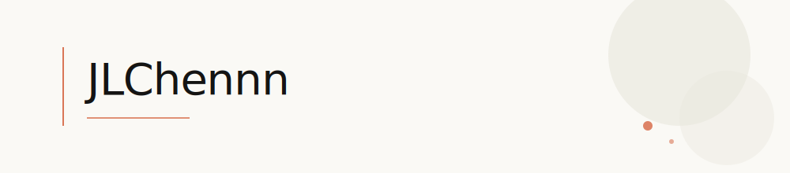

 

  <samp>
    <!-- 你的研究方向或身份，例如：Computer Science Graduate Student · Systems &amp; ML -->
  </samp>

 

> *"In the age of freedom, be a blazing soul."*

 

## About

<!-- 一段稳定的自我介绍，1–3 句话，避免频繁变更 -->

I am a graduate student in Computer Science, interested in the design and implementation of systems that are reliable, efficient, and scalable.
My work sits at the intersection of computer systems and machine learning.

 

## Research Interests

- Large Language Model 
- Agent
- Reinforcement Learning
<!--   -->

<!--   -->

<!-- ## Publications -->

<!-- 如有论文，按格式列出；没有可删除本段 -->
<!-- 1. **论文标题**  -->
   <!-- 作者列表 --> 
   <!-- *会议/期刊名称，年份* · [paper](https://) · [code](https://github.com/JLChennn/) -->

<!--   -->

<!-- ## Writing -->

<!-- 长期有效的文章、笔记或博客 -->
<!-- - [文章标题](https://链接) — 简短描述 -->

<!--   -->

## Contact

<!--
  修改方式：
  1. 把 href 里的占位符换成你的真实链接
  2. 把 badge 文字 "待填写" 换成你想要的显示文字
  3. 不需要的链接可以直接删除整行；需要 website 则取消下面一行的注释
-->

  
  
  <!--  -->

